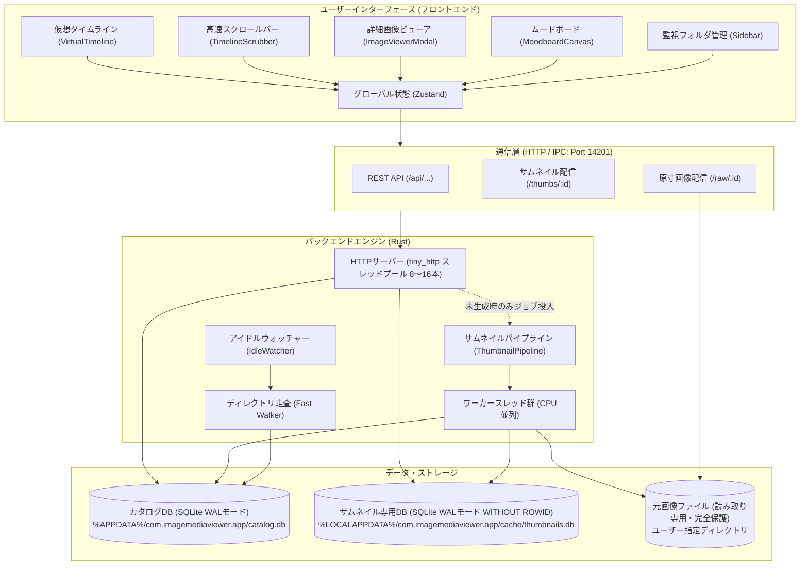
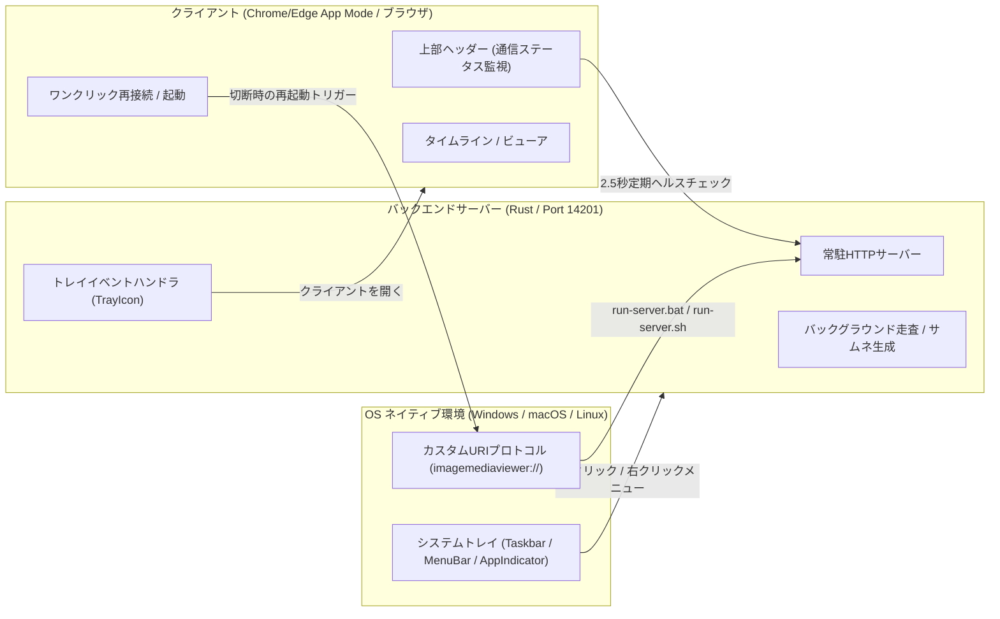
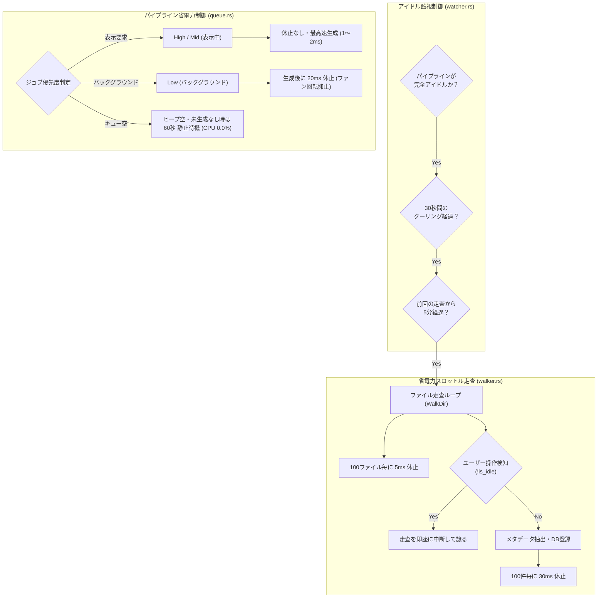

# ImageMediaViewer システム設計書 (Architecture & Design)

本書は、**ImageMediaViewer** の内部構造、データ設計、コンポーネント構成、高速化アルゴリズム、およびインターフェース仕様を記述したシステム設計書です。

---

## 1. システム全体アーキテクチャ

ImageMediaViewer は、**フロントエンド（React / TypeScript / Tailwind CSS）** と **バックエンド（Rust 高速ネイティブエンジン）** の2層構造を採用し、ローカル HTTP サーバー（ポート `14201`）経由で疎結合に連携します。



---

## 2. フロントエンド設計 (Frontend Architecture)

### 2.1 コンポーネントツリー
```text
src/
├── App.tsx                     # メインシェル、ビュー切替 (Timeline / Board)
├── components/
│   ├── Sidebar/
│   │   └── Sidebar.tsx         # 登録フォルダ一覧、ドラッグ並替、進捗バッジ、再作成ボタン
│   ├── StatusBar/
│   │   └── StatusBar.tsx       # 全体進捗バー、走査ステータス、生成中インジケータ
│   ├── TimelineGrid/
│   │   ├── VirtualTimeline.tsx # @tanstack/react-virtual による仮想化タイムライン
│   │   ├── TimelineToolbar.tsx # 検索、ソート順、グリッドサイズ、しおりボタン
│   │   ├── TimelineScrubber.tsx# Picasaスタイル縦型スクラブバー（年月・枚数バッジ追従）
│   │   ├── BookmarkPopover.tsx # しおり保存・一覧ポップオーバー
│   │   ├── GridCell.tsx        # 各画像セル、多層リトライ、スケルトン表示
│   │   └── DateHeader.tsx      # 日付（日別）ヘッダーブロック
│   ├── Viewer/
│   │   ├── ImageViewerModal.tsx# 原寸画像表示モーダル、回転・反転・パン・ズーム
│   │   └── useViewerGestures.ts# マウス・タッチジェスチャー制御
│   ├── Moodboard/
│   │   ├── MoodboardCanvas.tsx # 無限キャンバス、アイテム/メモ自由配置、クリッピング
│   │   └── AddToBoardModal.tsx # タイムライン画像追加モーダル
│   └── Common/
│       ├── ImageDetailPanel.tsx# 共通画像詳細パネル（タイムライン/ムードボード共用）
│       └── LogViewerModal.tsx  # システムログ & サムネイル失敗診断モーダル
├── hooks/
│   ├── usePagedImages.ts       # ページ単位の画像取得・キャッシュ・世代同期
│   ├── useTimelineLayout.ts    # ウィンドウ幅連動の動的列数追従 (4, 6, 8, 12列)
│   ├── useScrollVelocity.ts    # スクロール速度検知 (800px/s 閾値パージ)
│   ├── useViewportPrioritizer.ts# 現画面の画像IDをバックエンドへ優先通知
│   ├── useBackendEvents.ts     # 進捗・カタログ変更イベントのポーリング・購読
│   └── useWindowState.ts       # ハートビート送信、終了検知、ウィンドウ状態復元
└── utils/
    └── imageMetadata.ts        # フォーマット解析、可逆/非可逆判定、生データ比・圧縮率計算
```

### 2.2 仮想スクロールと動的列レイアウト設計
* **ウィンドウ幅連動の列数自動計算**:
  * 画面幅 `< 768px`: 4列
  * `768px 〜 1280px`: 6列
  * `1280px 〜 1920px`: 8列
  * `> 1920px`: 12列
* **行データ構造 (`buildRows.ts`)**:
  * タイムラインは「日付ヘッダー行」と「画像サムネイル行」の2種類の行（Row）から構成。
  * 日別バケット情報から各日の画像枚数を列数で割って行数を算出し、フラットな仮想アイテム配列を生成。10万件であっても初期描画に必要なデータは数KBのバケット配列のみ。

### 2.3 キャッシュと世代同期 (`usePagedImages.ts`)
* 画面に表示される行のインデックスから、必要なページ（1ページ=50件）を動的に要求。
* インメモリキャッシュ（`cacheRef`）により、一度取得したページは再マウント時でも 0ms で描画。
* スクロールにより世代番号が進んだ場合でも、受信したページデータは安全にキャッシュに格納され、無条件で `setVersionTick` を発行してスケルトン固まりを防止。

### 2.4 タイムライン複数選択とラバーバンドドラッグ選択設計 (`VirtualTimeline.tsx`, `GridCell.tsx`)
* **グローバル選択状態管理 (`store/index.ts`)**:
  * `selectedImageIds: number[]` を Zustand ストアで一元管理。
  * `toggleSelectImageId(id)`: 個別選択のトグル。
  * `setSelectedImageIds(ids)`: 範囲選択や全選択時の一括更新。
  * `clearSelectedImageIds()`: 一括選択解除。
* **仮想スクロール環境下での AABB 矩形交差判定**:
  * グリッド背景のドラッグ開始時（ドラッグ距離 > 6px）にラバーバンド選択モードへ移行。
  * ドラッグ開始点 $(x_1, y_1)$ と現在点 $(x_2, y_2)$ から選択矩形 $B = [\min(x_1, x_2), \max(x_1, x_2)] \times [\min(y_1, y_2), \max(y_1, y_2)]$ を算出。
  * 画面内に仮想マウントされている全画像セル（`[data-grid-cell="true"]`）の `getBoundingClientRect()` と $B$ との交差（Axis-Aligned Bounding Box Intersection）を高速判定し、交差した全画像の `data-image-id` を即座に `selectedImageIds` に反映。
* **操作性と安全ガード**:
  * スクラブバー、ツールバー、各種ボタン、モーダル上のクリックを `target.closest` によりドラッグ選択開始から除外。
  * グローバル `window.addEventListener("mouseup")` リスナーにより、ウィンドウ外やスクロールバー上でマウスを離した場合でも確実にドラッグ状態を解除。
  * `Esc` キー押下で即座に全選択解除、`Ctrl + A` で現在読み込み済みの全画像を全選択。
  * 選択中セルは青枠＋シャドウ＋半透明ブルーオーバーレイ＋左上チェックバッジで強調。未選択セルもホバー時に薄いチェックバッジを表示して選択可能性を明示。
* **一括アクションバー＆ツールバー連携**:
  * 1枚以上選択されている場合、タイムライン最上部に「○枚選択中」「➕ ムードボードに登録」「✕ 選択解除」の固定バーを表示。
  * ツールバー右側の「ボードに追加」ボタンも「ボードに追加 (○枚)」へと動的に切り替わり、既存の `AddToBoardModal` へ選択配列をシームレスに引き渡し。

### 2.5 ムードボードと共通メタデータ設計 (`MoodboardCanvas.tsx`, `ImageDetailPanel.tsx`, `imageMetadata.ts`)
* **画像アイテムとテキストメモ矩形のハイブリッド描画**:
  * ムードボード上には、写真画像アイテム（`BoardItem`）とテキスト付箋メモ（`BoardNote`）が混在配置可能。
  * 共通の `z_index` を用いて、画像の上にメモを置いたり、メモの下に画像を潜り込ませる自然なコラージュ制御を実現。
  * 各アイテムはマウスドラッグによる自由な移動、右下ハンドルによる直感的なリサイズに対応。
  * 付箋メモはダブルクリックまたはアクションバーから即座にテキスト編集可能（`Ctrl+Enter` で確定）。カラーパレット（イエロー、ブルー、グリーン、ピンク、パープル、ダーク）の切替もワンクリックで反映。
* **高精度ドラッグ＆永続化安全ガード**:
  * React の非同期ステートやクロージャ依存による移動先座標・対象IDの取りこぼしを防ぐため、ドラッグ中・リサイズ中の最新座標（`currentNotePosRef`）および対象ID（`draggingNoteIdRef`）を `useRef` でリアルタイム同期。
  * ウィンドウ外や他UI要素上でマウスボタンを離した場合のドラッグ残留（マウス追従）を根絶するため、グローバルな `window.addEventListener("mouseup")` 安全ガードリスナーを装備。
  * テキスト入力中の誤ドラッグ防止（`stopPropagation`）およびブラウザ標準テキスト選択との競合防止制御を実装。
* **自動並び替え（Row-based Flow Packing）アルゴリズム (`handleAutoArrange`)**:
  * **手動実行トリガー**: ユーザーが意図して重ねたりレイアウトした配置を勝手に破壊しないよう、上部コントロールバーの「📐 自動並び替え」ボタンからのみ明示的に実行。
  * **実占有サイズの算出**:
    * 各画像アイテムの幅・高さ: $W_i = \text{item.width} \times \text{item.scale}$, $H_i = \text{item.height} \times \text{item.scale}$
    * 各付箋メモの幅・高さ: $W_n = \text{note.width}$, $H_n = \text{note.height}$
  * **行ベース・フロー配置**:
    * アイテム間隔（マージン）を $M = 28\text{px}$、行の最大幅ターゲットを $W_{\max} = 1800\text{px}$ と設定。
    * アイテムを左から右へ順に並べ、現在の行幅 $+ W_k + M > W_{\max}$ となった場合に次行へ折り返し。
    * 行内の最大高さ $\max(H_{\text{row}})$ にマージンを加算して次の行の Y 座標とし、すべての要素同士の重複（被り）を幾何学的に 100% 排除。
    * 矩形の角の衝突や視認性低下を防ぐため、整列時に回転角（`rotation`）を 0° にリセット。
  * **カメラの自動追従 (Zoom to Fit)**:
    * 全整列要素の外接矩形 $[\min X, \max X] \times [\min Y, \max Y]$ を計算。
    * キャンバスの表示領域（幅 $W_c$, 高さ $H_c$）と外接矩形寸法を比較し、全体が画面にすっぽり収まる最適なズーム率 $Z = \text{clamp}(0.9 \times \min(W_c / W_{\text{all}}, H_c / H_{\text{all}}), 0.2, 1.0)$ を算出。
    * ビューポート中央に配置されるパン座標 $(P_x, P_y)$ を設定し、整列直後に全体像を美しく俯瞰可能。
  * **非同期一括永続化**:
    * 整列後の新座標を `backendApi.updateBoardItem` および `backendApi.updateBoardNote` により SQLite DB へ一括永続化。
* **共通詳細情報パネル連携 (`ImageDetailPanel`)**:
  * タイムラインのビューアモーダルとムードボードのキャンバス右下で全く同一のコンポーネントを利用し、UI/UX の一貫性を担保。
  * 選択中画像の詳細をキーボードショートカット `I` またはアクションバーの「詳細情報」ボタンで即座に展開・格納。
* **画像メタデータ・圧縮率解析アルゴリズム (`imageMetadata.ts`)**:
  * **フォーマット正規化**: 拡張子および MIME タイプに基づき、大文字フォーマット名（JPEG, PNG, WebP, GIF, BMP, TIFF, AVIF, HEIC等）を統一。
  * **可逆 / 非可逆判定**:
    * PNG, BMP, GIF, TIFF: 可逆圧縮（Lossless）
    * JPEG: 非可逆圧縮（Lossy）
    * WebP: 拡張子・mime・メタデータから判定（デフォルトは WebP Lossy）
  * **生RGB比と圧縮率計算**:
    * 画像の非圧縮24bit RGB生データサイズを算出: $\text{RawSize} = \text{width} \times \text{height} \times 3 \text{ bytes}$
    * 削減率（Compression Ratio）: $\text{Reduction} = \frac{\text{RawSize} - \text{file\_size}}{\text{RawSize}} \times 100\%$
    * 生データ比: $\text{RawPercent} = \frac{\text{file\_size}}{\text{RawSize}} \times 100\%$
    * 1ピクセルあたり実効ビット数: $\text{bpp} = \frac{\text{file\_size} \times 8}{\text{width} \times \text{height}}$
    * 寸法不明時やBMP等の非圧縮ファイル時も適切なフォールバック表示を実施。

---

## 3. バックエンド設計 (Backend Architecture)

### 3.1 ローカル HTTP サーバー設計 (`server.rs`)
* **固定スレッドプール**:
  * Windows 環境でのスレッド生成オーバーヘッドを排除するため、CPU コア数に応じた固定スレッドプール（8〜16スレッド）を起動。
* **サムネイル配信ハンドラ (`/thumbs/:id`) の高速配信＆実アクセス時更新検知**:
  ```text
  クライアント要求: GET /thumbs/:id
       │
       ├─ [1] 実アクセス時更新検知 (On-Access Change Detection):
       │        └─ std::fs::metadata で実ファイルの (size, mtime) を軽量確認 (< 0.05ms)
       │        └─ 変更検知時: 新 quick_hash / EXIF 再計算 → images レコード更新
       │                        → 新サムネ生成キュー投入 (High) → 503 即時返却 (リトライ誘導)
       │                        （CAS原則: 旧ハッシュのBLOBは他画像が共有している可能性があるため即時削除せず維持）
       │
       ├─ [2] インメモリ WebP キャッシュにあれば即返却 (0ms)
       ├─ [3] サムネイル専用DB (thumbnails.db) にあれば mmap ゼロコピー返却 (< 0.5ms)
       ├─ [4] 旧ファイルキャッシュ (thumbs/v1/{hash}.webp) があれば DB へ自動移行して返却 (< 1ms)
       └─ [5] サムネイル未存在の場合:
               ├─ パイプラインへ高優先度 (High) でジョブ投入
               └─ HTTPスレッドは待機せず直ちに「503 Service Unavailable」を返却 (0ms)
                  （HTTPスレッドは即解放され、次のAPI通信を一切邪魔しない）
  ```

### 3.2 高速サムネイル生成パイプライン (`queue.rs`, `thumbnail.rs`)
* **優先度ヒープキュー (Priority Queue)**:
  * `High`: 現在画面に見えている画像セル
  * `Mid`: 画面の周辺（先読み対象）
  * `Low`: バックグラウンド自動補完（空き時間に全件走査生成）
* **世代管理 (Generation Tracking)**:
  * ユーザーがスクロールするたびに世代番号（`generation`）をインクリメント。
  * 古い世代の待機要求は即座に破棄（パージ）され、現在見えている位置の画像に全 CPU リソースを集中。
* **EXIF IFD1 内蔵サムネイル最優先抽出アルゴリズム**:
  ```text
  元画像ファイル (source_path)
       │
       ├─ EXIF解析 (kamadak-exif)
       │   └─ IFD1 に Tag::JPEGInterchangeFormat が存在するか？
       │        ├─ [YES]: 内蔵サムネイルJPEGバイトを抽出
       │        │         └─ 数MB〜数十MBの元画像フル展開を 100% 回避
       │        │         └─ 内蔵JPEGを直接デコード・WebP化 (所要時間: 1〜3ms)
       │        └─ [NO]: 元画像全体を制限付きリーダーで安全にデコード (フォールバック)
       │
       ├─ fast_image_resize による SIMD 縮小リサイズ
       ├─ WebP lossy エンコード (品質 60.0)
       └─ サムネイル専用DB (thumbnails.db) へ BLOB 格納 (WITHOUT ROWID)
  ```

### 3.3 自動差分走査＆アイドルウォッチャー＆孤立サムネイルGC (`walker.rs`, `watcher.rs`)
* **高速走査**: `walkdir` による再帰走査と `rayon` による並行メタデータ抽出。
* **クイックハッシュ (`hash.rs`)**:
  * ファイル先頭・中間・末尾の各 64KB ＋ ファイルサイズを組み合わせた BLAKE3 ハッシュにより、巨大画像やRAWでも一瞬で重複検知・一意識別キーを生成。
* **アイドルウォッチャー**:
  * サムネイルキューが空、かつユーザー操作がないアイドル時（45秒経過後）に登録フォルダの差分スキャンを自動実行。
* **孤立サムネイル回収 (Garbage Collection: GC)**:
  * フォルダ差分スキャン完了後のアイドル時に、`thumbnails.db` のハッシュ一覧と `catalog.db` の `images` テーブルを照合。
  * 画像ファイルの更新や削除によりどの画像からも参照されなくなった孤立 BLOB（参照数 0）を特定し、安全に増分一括削除（`delete_batch`）。キューへのジョブ到着時は即座に中断。

---

## 4. データベース設計 (Database Schema)

カタログデータは SQLite データベース（WAL モード）で管理されます。

### 4.1 テーブル定義

#### ① `watched_folders` (監視対象フォルダ)
```sql
CREATE TABLE watched_folders (
    id INTEGER PRIMARY KEY AUTOINCREMENT,
    path TEXT NOT NULL UNIQUE,          -- 正規化済みディレクトリパス
    last_scanned_at INTEGER NOT NULL    -- 最終走査日時 (UNIXエポック秒)
);
```

#### ② `images` (画像メタデータ)
```sql
CREATE TABLE images (
    id INTEGER PRIMARY KEY AUTOINCREMENT,
    folder_id INTEGER NOT NULL REFERENCES watched_folders(id) ON DELETE CASCADE,
    file_path TEXT NOT NULL UNIQUE,     -- 元ファイルの絶対パス
    file_size INTEGER NOT NULL,         -- ファイルサイズ (バイト)
    file_mtime INTEGER NOT NULL,        -- ファイル更新日時 (UNIXエポック秒)
    taken_at INTEGER NOT NULL,          -- 撮影日時 (EXIFまたはmtime)
    taken_at_source INTEGER NOT NULL,   -- 0: Exif, 1: mtime
    width INTEGER,                      -- 幅 (Orientation適用後)
    height INTEGER,                     -- 高さ (Orientation適用後)
    orientation INTEGER NOT NULL DEFAULT 1, -- EXIF Orientation (1〜8)
    format TEXT,                        -- 拡張子 / フォーマット ('jpg', 'png' 等)
    quick_hash TEXT NOT NULL,           -- BLAKE3 クイックハッシュ (サムネファイル名)
    thumb_status INTEGER NOT NULL DEFAULT 0, -- 0: 未生成, 1: 生成済, 2: 失敗
    indexed_at INTEGER NOT NULL         -- カタログ登録日時
);

CREATE INDEX idx_images_taken_at_id ON images(taken_at DESC, id DESC);
CREATE INDEX idx_images_folder_id ON images(folder_id);
CREATE INDEX idx_images_thumb_status ON images(thumb_status);
CREATE INDEX idx_images_quick_hash ON images(quick_hash);
```

#### ③ `boards` (ムードボード)
```sql
CREATE TABLE boards (
    id INTEGER PRIMARY KEY AUTOINCREMENT,
    name TEXT NOT NULL,
    background_color TEXT NOT NULL DEFAULT '#121214',
    pan_x REAL NOT NULL DEFAULT 0.0,
    pan_y REAL NOT NULL DEFAULT 0.0,
    zoom REAL NOT NULL DEFAULT 1.0,
    created_at INTEGER NOT NULL,
    updated_at INTEGER NOT NULL
);
```

#### ④ `board_items` (ボード配置アイテム)
```sql
CREATE TABLE board_items (
    id INTEGER PRIMARY KEY AUTOINCREMENT,
    board_id INTEGER NOT NULL REFERENCES boards(id) ON DELETE CASCADE,
    image_id INTEGER NOT NULL REFERENCES images(id) ON DELETE CASCADE,
    x REAL NOT NULL DEFAULT 0.0,
    y REAL NOT NULL DEFAULT 0.0,
    width REAL NOT NULL DEFAULT 240.0,
    height REAL NOT NULL DEFAULT 180.0,
    rotation REAL NOT NULL DEFAULT 0.0,
    z_index INTEGER NOT NULL DEFAULT 0,
    crop_x REAL NOT NULL DEFAULT 0.0,
    crop_y REAL NOT NULL DEFAULT 0.0,
    crop_width REAL NOT NULL DEFAULT 1.0,
    crop_height REAL NOT NULL DEFAULT 1.0,
    flip_h INTEGER NOT NULL DEFAULT 0,
    flip_v INTEGER NOT NULL DEFAULT 0,
    created_at INTEGER NOT NULL,
    updated_at INTEGER NOT NULL
);
```

#### ⑤ `board_notes` (ボード配置テキストメモ: マイグレーション v5)
```sql
CREATE TABLE board_notes (
    id INTEGER PRIMARY KEY AUTOINCREMENT,
    board_id INTEGER NOT NULL REFERENCES boards(id) ON DELETE CASCADE,
    text TEXT NOT NULL DEFAULT '',
    x REAL NOT NULL DEFAULT 0.0,
    y REAL NOT NULL DEFAULT 0.0,
    width REAL NOT NULL DEFAULT 200.0,
    height REAL NOT NULL DEFAULT 150.0,
    color TEXT NOT NULL DEFAULT '#fef08a', -- 付箋背景カラーコード
    z_index INTEGER NOT NULL DEFAULT 0,
    is_locked INTEGER NOT NULL DEFAULT 0,
    created_at INTEGER NOT NULL,
    updated_at INTEGER NOT NULL
);

CREATE INDEX idx_board_notes_board_id ON board_notes(board_id);
```

#### ⑥ `bookmarks` (タイムラインしおり: マイグレーション v6)
```sql
CREATE TABLE bookmarks (
    id TEXT PRIMARY KEY,
    title TEXT NOT NULL,
    folder_id INTEGER REFERENCES watched_folders(id) ON DELETE SET NULL,
    folder_name TEXT,
    sort TEXT NOT NULL,
    scroll_top REAL NOT NULL,
    row_index INTEGER NOT NULL,
    image_index INTEGER,
    day_label TEXT NOT NULL,
    created_at INTEGER NOT NULL
);

CREATE INDEX idx_bookmarks_created ON bookmarks(created_at DESC);
```

#### ⑦ `thumbnails` (サムネイル専用BLOBストア: `%LOCALAPPDATA%/.../cache/thumbnails.db`)
```sql
CREATE TABLE thumbnails (
    quick_hash  TEXT PRIMARY KEY,       -- BLAKE3 サンプリングハッシュ
    data        BLOB NOT NULL,          -- WebP バイナリ
    byte_size   INTEGER NOT NULL,       -- バイト数
    created_at  INTEGER NOT NULL        -- 生成日時 (UNIXエポック秒)
) WITHOUT ROWID;
```
* **WITHOUT ROWID の採用**: B-Tree リーフに直接 BLOB を配置し、インデックス引きとテーブル探索の二重ルックアップを排除して SQLite 公式ベンチマーク通りの最高速度を達成。
* **最適化 PRAGMA**: `page_size = 8192` (8KB), `mmap_size = 268435456` (256MB), `journal_mode = WAL`, `synchronous = NORMAL`。

---

## 5. 通信インターフェース仕様 (REST API)

| メソッド | パス | 機能概要 | レスポンス / 挙動 |
| :--- | :--- | :--- | :--- |
| `GET` | `/thumbs/:id` | サムネイル画像配信 | `image/webp` (キャッシュヒット時 200、生成中は 503 + Retry-After) |
| `GET` | `/raw/:id` | 原寸元画像配信 (ビューア用) | 各種 MIME タイプ (jpeg, png, 等) |
| `GET` | `/api/watch_folders` | 登録フォルダ一覧取得 | `WatchedFolder[]` (登録数、サムネ完了数、オンライン状態) |
| `POST` | `/api/watch_folders` | 新規フォルダ登録 | `{ path: string }` |
| `DELETE` | `/api/watch_folders/:id` | フォルダ登録解除 | レコードのみ削除（元ファイル保護） |
| `POST` | `/api/rescan` | フォルダ再走査実行 | `{ folder_id?: number }` |
| `GET` | `/api/timeline/summary` | タイムライン日別サマリ | `{ total: number, buckets: DayBucket[], version: number }` |
| `GET` | `/api/timeline/images` | タイムライン画像一覧取得 | `GetImagesPayload` に応じた `ImageRecord[]` |
| `GET` | `/api/images/:id` | 画像メタデータ詳細取得 | `ImageDetail` (EXIF情報含む) |
| `GET` | `/api/boards` | ボード一覧取得 | `Board[]` |
| `POST` | `/api/boards` | 新規ボード作成 | `{ name: string }` → `Board` |
| `GET` | `/api/boards/:id/items` | ボード内アイテム一覧取得 | `BoardItem[]` |
| `POST` | `/api/boards/:id/items` | ボード内画像追加 | `AddBoardItemsPayload` → `BoardItem[]` |
| `PUT` | `/api/board_items/:id` | ボードアイテム更新 | `UpdateBoardItemPayload` → `BoardItem` |
| `DELETE` | `/api/board_items/:id` | ボードアイテム削除 | 200 OK |
| `GET` | `/api/boards/:id/notes` | ボード内メモ一覧取得 | `BoardNote[]` |
| `POST` | `/api/boards/:id/notes` | 新規メモ作成 | `CreateBoardNotePayload` → `BoardNote` |
| `PUT` | `/api/board_notes/:id` | メモ更新 (位置/サイズ/テキスト/色/Z/ロック) | `UpdateBoardNotePayload` → `BoardNote` |
| `DELETE` | `/api/board_notes/:id` | メモ削除 | 200 OK |
| `POST` | `/api/viewport` | 現画面表示範囲の通知 | `{ visibleIds: number[], nearbyIds: number[] }` |
| `POST` | `/api/clear_queue` | サムネイルキュー即時パージ | 古い待機リクエストを一掃解放 |
| `POST` | `/api/thumbnails/rescan_missing` | 未生成・失敗サムネ一括再作成 | 失敗ステータスリセット ＆ バックグラウンド生成開始 |
| `GET` | `/api/thumb_progress` | サムネイル全体進捗取得 | `{ done: number, failed: number, total: number, isGenerating: boolean }` |
| `GET` | `/api/thumbnails/failed` | 失敗画像レコード一覧取得 | `FailedImageRecord[]`（破損・空ファイル診断） |
| `GET` | `/api/logs` | 直近ログ取得 | `LogEntry[]`（メモリリングバッファから最新順取得） |
| `POST` | `/api/logs/open` | ログ保存先フォルダ表示 | OSファイルマネージャでログ保存先を開く |
| `GET` / `POST` | `/api/heartbeat` | フロントエンド・サーバー死活確認 | `{ alive: true, status: "ok", version: "0.1.0" }` |
| `GET` | `/api/health` | サーバーヘルスチェック | `{ alive: true, status: "ok", version: "0.1.0" }` |
| `POST` | `/api/shutdown` | バックエンド終了要求 | バックエンドプロセスを安全に終了 |

---

## 6. プロセス・ライフサイクルとシステムトレイ設計



### 6.1 システムトレイ常駐とプロセス常駐保護 (Process Lifecycle & Tray)
* **独立常駐**: サーバープロセスはクライアントウィンドウの開閉に左右されずバックグラウンドで安定常駐。
* **スリープ・省電力タスクキル防止（常駐保護設計）**:
  * ブラウザの「メモリセーバー」やタブサスペンド、PCスリープ復帰時にブラウザが勝手に発火する `pagehide` / `beforeunload` イベントでのシャットダウン要求（`navigator.sendBeacon("/api/shutdown")`）を完全撤廃。
  * サーバー側で `AUTO_EXIT_ON_IDLE: AtomicBool` による常駐ガードを導入。`--auto-exit` フラグが明示されていない常駐稼働時は、万一 `/api/shutdown` リクエストが届いてもプロセスを終了させず常駐を死守。
  * プロセスの明示的終了は、タスクトレイメニューの「終了」からのみ行われる設計とし、長時間放置での勝手な停止を根絶。
* **サーバー単体起動ランチャー (`run-server.bat` / `run-server.sh`)**:
  * クライアントウィンドウを起動せず、サーバープロセスのみをバックグラウンド起動。
  * スクリプト内の `cd /d "%~dp0"` により作業ディレクトリをスクリプト位置へ確実に固定し、URIプロトコル呼び出し時（CWDがSystem32等になる問題）でも確実にバイナリを実行。
  * 多重起動防止ガード（PowerShell `Get-Process` / `pgrep`）を備え、既に起動中の場合は重複してプロセスを立ち上げない安全設計。
* **ネイティブトレイアイコン**: Windows通知領域、macOSメニューバー、Linuxシステムトレイ（AppIndicator）に対応。
* **トレイ右クリックメニュー**:
  * **クライアントを開く**: Chrome/Edge App Mode（または既定ブラウザ）でクライアントを即時起動。
  * **フォルダを再走査**: 登録済みフォルダの差分スキャンをバックグラウンド実行。
  * **データフォルダを開く**: カタログDBおよびサムネイルキャッシュのディレクトリをOSファイルマネージャで開く。
  * **終了**: サーバープロセスを安全に終了。

### 6.2 通信状態監視と再接続 (Heartbeat & Multi-platform Recovery)
* **常時監視**: クライアント上部右側の `ConnectionStatusIndicator` により、定期ハートビート（`/api/heartbeat`）で通信状態を可視化。
* **多重起動防止型ワンクリック起動**:
  * カスタムプロトコル `imagemediaviewer://launch` のターゲットを、クライアント起動スクリプト（`run.bat`）からサーバー専用ランチャー（`run-server.bat`）へ変更。
  * クライアント画面が開いている状態で回復ボタンを押しても、新しいクライアントウィンドウが多重起動しない仕様に改善。
* **OS自動判定によるクロスプラットフォーム回復対応**:
  * フロントエンドがユーザーの `navigator.userAgent` / `navigator.platform` から稼働OS（Windows / macOS / Linux）を自動判定。
  * 手動回復用コマンドのコピーボタンを、Windows環境では `.\run-server.bat`、macOS / Linux 環境では `./run-server.sh` に自動で切り替え。
* **段階的自動リトライ機構**:
  * URIスキーム呼び出し直後、OSプロセス起動のタイムラグ（1.2秒、3秒、5秒）を考慮した段階的自動再接続リトライを実施し、復旧成功率を大幅に向上。
* **自動復帰**: 切断状態からサーバーが再起動・復帰した場合、自動的にタイムラインや画像サマリを再同期。

---

## 7. ログ・エラー診断アーキテクチャ (Logging & Diagnostics)

```mermaid
flowchart TD
    subgraph Engine ["ネイティブエンジン内部"]
        TracingEvents["tracing イベント\n(info!, warn!, error!)"]
        CustomLayer["カスタムレイヤー\n(MemoryAndFileLoggerLayer)"]
        LogMgr["ログマネージャ\n(LogManager)"]
        LogFile["ログファイル永続化\n%APPDATA%/.../logs/app.log"]
        RingBuffer["インメモリリングバッファ\n(直近500件)"]
    end

    subgraph StatusManagement ["サムネイル状態管理"]
        Queue["キューワーカー (queue.rs)"]
        Repo["DBリポジトリ (repo.rs)"]
        CatalogDB[("カタログDB (imagesテーブル)")]
    end

    subgraph ClientDiag ["クライアントUI (診断)"]
        StatusBar["StatusBar (進捗・失敗バッジ)"]
        LogModal["LogViewerModal (ログ・失敗一覧)"]
        Tray["システムトレイメニュー"]
    end

    TracingEvents --> CustomLayer
    CustomLayer --> LogMgr
    LogMgr --> LogFile
    LogMgr --> RingBuffer

    Queue -->|生成失敗時 (thumb_status=2)| Repo
    Repo -->|未生成(0)と失敗(2)を厳密分離| CatalogDB
    Queue -->|エラー詳細・パス・画像ID出力| TracingEvents

    RingBuffer -->|GET /api/logs| LogModal
    CatalogDB -->|GET /api/thumbnails/failed| LogModal
    CatalogDB -->|GET /api/thumb_progress| StatusBar
    Tray -->|POST /api/logs/open| LogFile
```

### 7.1 ログ多層出力とインメモリバッファ
* **多層出力パイプライン**:
  * `tracing-subscriber` のカスタム `Layer` 実装により、標準出力へのリアルタイム出力と同時に、ファイル永続出力および最新500件のインメモリリングバッファへ逐次記録。
* **ファイル永続化**:
  * `%APPDATA%\com.imagemediaviewer.app\logs\app.log` へ常時アペンド保存。Windows GUI / 非表示バックグラウンド稼働時でもログが消失しない。
* **低レイテンシAPI取得**:
  * クライアントは `/api/logs` により、ディスク読み取り負荷なしにインメモリバッファから瞬時に直近ログを取得可能。

### 7.2 サムネイル生成失敗管理と無限ループ防止
* **状態コードの厳密分離**:
  * `thumb_status = 0`: 未生成（生成対象）
  * `thumb_status = 1`: 生成完了
  * `thumb_status = 2`: 生成失敗（破損画像、0バイトファイル、未対応動画/特殊形式等）
* **補充ループ防止**:
  * `get_pending_thumb_sources` で `thumb_status = 0` のみを抽出対象とし、失敗した画像（`thumb_status = 2`）がキューへ延々と再投入される無限ループを根絶。
* **原因特定・診断UI**:
  * `StatusBar` で「○件完了 / △件失敗」を明確に示し、ワンクリックで `LogViewerModal` を起動。失敗画像のパス・サイズ・形式を確認し、エクスプローラでの直接確認およびワンクリック再試行（リセット＆再スキャン）を実行可能。

---

## 8. 省電力・静音スロットリングアーキテクチャ (Eco & Quiet Throttling)

常駐型デスクトップアプリケーションとして、長期間のバックグラウンド稼働時にCPUファンが高速回転したりCPU使用率を無駄に消費しないための多層スロットリング制御を実装しています。



### 8.1 アイドル走査スロットリング (walker.rs & watcher.rs)
* **適正な実行インターバルとクーリング期間**:
  * 差分走査の間隔を従来の45秒から **5分（300秒）** に拡大。
  * サムネイルパイプラインがアイドルになった後、**30秒間のクーリング期間** を待機してから走査を開始し、ユーザーの連続作業の合間に無駄なI/Oが発生するのを抑制。
* **Walking フェーズの I/O スロットリング**:
  * 100ファイル走査するごとに **5ms のスレッド休止** を挿入。ディスクI/Oキューの過熱とCPU 1コア100%張り付きを防ぎ、平均CPU負荷 1〜3% で静かに走査を完了。
* **ユーザー最優先の即時中断 (Preemption)**:
  * バックグラウンド走査中、50ファイル毎および各バッチ処理時にパイプラインのアイドル状態を監視。ユーザーがスクロールや画像クリック等を行った場合は、即座に走査を安全中断してCPU・ディスクリソースを最優先でUIへ明け渡す。
* **Indexing フェーズの負荷分散**:
  * メタデータ抽出バッチを100件単位に縮小し、バッチ毎に **30ms のクーリング休止** を挿入。

### 8.2 バックグラウンドサムネイル生成のクーリング休止 (queue.rs)
* **表示中ジョブとバックグラウンドジョブの分離**:
  * ユーザーが見ている画面（High / Mid 優先度）は休止なしで **最速生成（1〜2ms / 枚）** を維持。
  * 画面外の事前生成（Low 優先度）は、1枚のサムネイル生成完了ごとに **20ms のクーリング休止** を挿入。
  * これにより、何千枚ものサムネイルを連続生成している最中でも、CPU使用率は 10〜15% 程度に抑制され、**ノートPCやデスクトップのCPUファンが唸るのを確実に防止**。

### 8.3 ワーカースレッドの完全アイドル待機 (queue.rs)
* **無駄な定期起床の根絶**:
  * キューが空で未生成サムネイルもない定常時、ワーカースレッド群の条件変数タイムアウトを従来の5秒から **60秒** へ延長。
  * 常駐アイドル時のCPU使用率は **0.0%** を維持し、バッテリー消費や発熱を最小限に抑える。
  * 新規画像の追加や表示スクロールが発生した際は、`Condvar::notify_one` / `notify_all` により **0ミリ秒で即座に起床** するため、応答性への悪影響は皆無。


