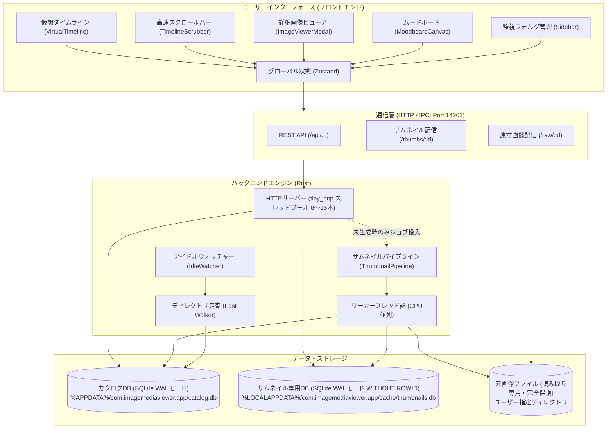
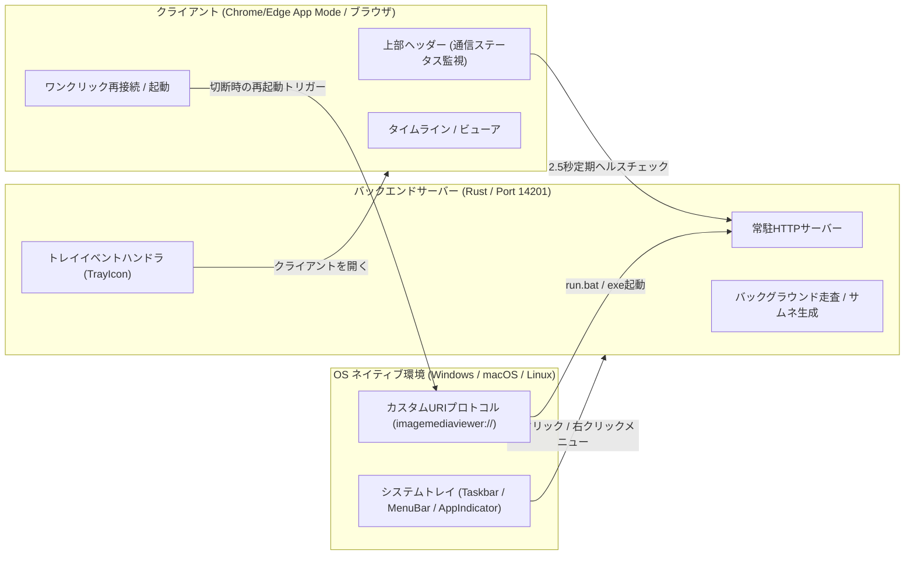

# ImageMediaViewer システム設計書 (Architecture & Design)

本書は、**ImageMediaViewer** の内部構造、データ設計、コンポーネント構成、高速化アルゴリズム、およびインターフェース仕様を記述したシステム設計書です。

---

## 1. システム全体アーキテクチャ

ImageMediaViewer は、**フロントエンド（React / TypeScript / Tailwind CSS）** と **バックエンド（Rust 高速ネイティブエンジン）** の2層構造を採用し、ローカル HTTP サーバー（ポート `14201`）経由で疎結合に連携します。



---

## 2. フロントエンド設計 (Frontend Architecture)

### 2.1 コンポーネントツリー
```text
src/
├── App.tsx                     # メインシェル、ビュー切替 (Timeline / Board)
├── components/
│   ├── Sidebar/
│   │   └── Sidebar.tsx         # 登録フォルダ一覧、ドラッグ並替、進捗バッジ、再作成ボタン
│   ├── StatusBar/
│   │   └── StatusBar.tsx       # 全体進捗バー、走査ステータス、生成中インジケータ
│   ├── TimelineGrid/
│   │   ├── VirtualTimeline.tsx # @tanstack/react-virtual による仮想化タイムライン
│   │   ├── TimelineToolbar.tsx # 検索、ソート順、グリッドサイズ、しおりボタン
│   │   ├── TimelineScrubber.tsx# Picasaスタイル縦型スクラブバー（年月・枚数バッジ追従）
│   │   ├── BookmarkPopover.tsx # しおり保存・一覧ポップオーバー
│   │   ├── GridCell.tsx        # 各画像セル、多層リトライ、スケルトン表示
│   │   └── DateHeader.tsx      # 日付（日別）ヘッダーブロック
│   ├── Viewer/
│   │   ├── ImageViewerModal.tsx# 原寸画像表示モーダル、回転・反転・パン・ズーム
│   │   └── useViewerGestures.ts# マウス・タッチジェスチャー制御
│   └── Moodboard/
│       ├── MoodboardCanvas.tsx # 無限キャンバス、アイテム自由配置、矩形クリッピング
│       └── AddToBoardModal.tsx # タイムライン画像追加モーダル
└── hooks/
    ├── usePagedImages.ts       # ページ単位の画像取得・キャッシュ・世代同期
    ├── useTimelineLayout.ts    # ウィンドウ幅連動の動的列数追従 (4, 6, 8, 12列)
    ├── useScrollVelocity.ts    # スクロール速度検知 (800px/s 閾値パージ)
    ├── useViewportPrioritizer.ts# 現画面の画像IDをバックエンドへ優先通知
    ├── useBackendEvents.ts     # 進捗・カタログ変更イベントのポーリング・購読
    └── useWindowState.ts       # ハートビート送信、終了検知、ウィンドウ状態復元
```

### 2.2 仮想スクロールと動的列レイアウト設計
* **ウィンドウ幅連動の列数自動計算**:
  * 画面幅 `< 768px`: 4列
  * `768px 〜 1280px`: 6列
  * `1280px 〜 1920px`: 8列
  * `> 1920px`: 12列
* **行データ構造 (`buildRows.ts`)**:
  * タイムラインは「日付ヘッダー行」と「画像サムネイル行」の2種類の行（Row）から構成。
  * 日別バケット情報から各日の画像枚数を列数で割って行数を算出し、フラットな仮想アイテム配列を生成。10万件であっても初期描画に必要なデータは数KBのバケット配列のみ。

### 2.3 キャッシュと世代同期 (`usePagedImages.ts`)
* 画面に表示される行のインデックスから、必要なページ（1ページ=50件）を動的に要求。
* インメモリキャッシュ（`cacheRef`）により、一度取得したページは再マウント時でも 0ms で描画。
* スクロールにより世代番号が進んだ場合でも、受信したページデータは安全にキャッシュに格納され、無条件で `setVersionTick` を発行してスケルトン固まりを防止。

---

## 3. バックエンド設計 (Backend Architecture)

### 3.1 ローカル HTTP サーバー設計 (`server.rs`)
* **固定スレッドプール**:
  * Windows 環境でのスレッド生成オーバーヘッドを排除するため、CPU コア数に応じた固定スレッドプール（8〜16スレッド）を起動。
* **サムネイル配信ハンドラ (`/thumbs/:id`) の高速配信＆実アクセス時更新検知**:
  ```text
  クライアント要求: GET /thumbs/:id
       │
       ├─ [1] 実アクセス時更新検知 (On-Access Change Detection):
       │        └─ std::fs::metadata で実ファイルの (size, mtime) を軽量確認 (< 0.05ms)
       │        └─ 変更検知時: 新 quick_hash / EXIF 再計算 → images レコード更新
       │                        → 新サムネ生成キュー投入 (High) → 503 即時返却 (リトライ誘導)
       │                        （CAS原則: 旧ハッシュのBLOBは他画像が共有している可能性があるため即時削除せず維持）
       │
       ├─ [2] インメモリ WebP キャッシュにあれば即返却 (0ms)
       ├─ [3] サムネイル専用DB (thumbnails.db) にあれば mmap ゼロコピー返却 (< 0.5ms)
       ├─ [4] 旧ファイルキャッシュ (thumbs/v1/{hash}.webp) があれば DB へ自動移行して返却 (< 1ms)
       └─ [5] サムネイル未存在の場合:
               ├─ パイプラインへ高優先度 (High) でジョブ投入
               └─ HTTPスレッドは待機せず直ちに「503 Service Unavailable」を返却 (0ms)
                  （HTTPスレッドは即解放され、次のAPI通信を一切邪魔しない）
  ```

### 3.2 高速サムネイル生成パイプライン (`queue.rs`, `thumbnail.rs`)
* **優先度ヒープキュー (Priority Queue)**:
  * `High`: 現在画面に見えている画像セル
  * `Mid`: 画面の周辺（先読み対象）
  * `Low`: バックグラウンド自動補完（空き時間に全件走査生成）
* **世代管理 (Generation Tracking)**:
  * ユーザーがスクロールするたびに世代番号（`generation`）をインクリメント。
  * 古い世代の待機要求は即座に破棄（パージ）され、現在見えている位置の画像に全 CPU リソースを集中。
* **EXIF IFD1 内蔵サムネイル最優先抽出アルゴリズム**:
  ```text
  元画像ファイル (source_path)
       │
       ├─ EXIF解析 (kamadak-exif)
       │   └─ IFD1 に Tag::JPEGInterchangeFormat が存在するか？
       │        ├─ [YES]: 内蔵サムネイルJPEGバイトを抽出
       │        │         └─ 数MB〜数十MBの元画像フル展開を 100% 回避
       │        │         └─ 内蔵JPEGを直接デコード・WebP化 (所要時間: 1〜3ms)
       │        └─ [NO]: 元画像全体を制限付きリーダーで安全にデコード (フォールバック)
       │
       ├─ fast_image_resize による SIMD 縮小リサイズ
       ├─ WebP lossy エンコード (品質 60.0)
       └─ サムネイル専用DB (thumbnails.db) へ BLOB 格納 (WITHOUT ROWID)
  ```

### 3.3 自動差分走査＆アイドルウォッチャー＆孤立サムネイルGC (`walker.rs`, `watcher.rs`)
* **高速走査**: `walkdir` による再帰走査と `rayon` による並行メタデータ抽出。
* **クイックハッシュ (`hash.rs`)**:
  * ファイル先頭・中間・末尾の各 64KB ＋ ファイルサイズを組み合わせた BLAKE3 ハッシュにより、巨大画像やRAWでも一瞬で重複検知・一意識別キーを生成。
* **アイドルウォッチャー**:
  * サムネイルキューが空、かつユーザー操作がないアイドル時（45秒経過後）に登録フォルダの差分スキャンを自動実行。
* **孤立サムネイル回収 (Garbage Collection: GC)**:
  * フォルダ差分スキャン完了後のアイドル時に、`thumbnails.db` のハッシュ一覧と `catalog.db` の `images` テーブルを照合。
  * 画像ファイルの更新や削除によりどの画像からも参照されなくなった孤立 BLOB（参照数 0）を特定し、安全に増分一括削除（`delete_batch`）。キューへのジョブ到着時は即座に中断。

---

## 4. データベース設計 (Database Schema)

カタログデータは SQLite データベース（WAL モード）で管理されます。

### 4.1 テーブル定義

#### ① `watched_folders` (監視対象フォルダ)
```sql
CREATE TABLE watched_folders (
    id INTEGER PRIMARY KEY AUTOINCREMENT,
    path TEXT NOT NULL UNIQUE,          -- 正規化済みディレクトリパス
    last_scanned_at INTEGER NOT NULL    -- 最終走査日時 (UNIXエポック秒)
);
```

#### ② `images` (画像メタデータ)
```sql
CREATE TABLE images (
    id INTEGER PRIMARY KEY AUTOINCREMENT,
    folder_id INTEGER NOT NULL REFERENCES watched_folders(id) ON DELETE CASCADE,
    file_path TEXT NOT NULL UNIQUE,     -- 元ファイルの絶対パス
    file_size INTEGER NOT NULL,         -- ファイルサイズ (バイト)
    file_mtime INTEGER NOT NULL,        -- ファイル更新日時 (UNIXエポック秒)
    taken_at INTEGER NOT NULL,          -- 撮影日時 (EXIFまたはmtime)
    taken_at_source INTEGER NOT NULL,   -- 0: Exif, 1: mtime
    width INTEGER,                      -- 幅 (Orientation適用後)
    height INTEGER,                     -- 高さ (Orientation適用後)
    orientation INTEGER NOT NULL DEFAULT 1, -- EXIF Orientation (1〜8)
    format TEXT,                        -- 拡張子 / フォーマット ('jpg', 'png' 等)
    quick_hash TEXT NOT NULL,           -- BLAKE3 クイックハッシュ (サムネファイル名)
    thumb_status INTEGER NOT NULL DEFAULT 0, -- 0: 未生成, 1: 生成済, 2: 失敗
    indexed_at INTEGER NOT NULL         -- カタログ登録日時
);

CREATE INDEX idx_images_taken_at_id ON images(taken_at DESC, id DESC);
CREATE INDEX idx_images_folder_id ON images(folder_id);
CREATE INDEX idx_images_thumb_status ON images(thumb_status);
CREATE INDEX idx_images_quick_hash ON images(quick_hash);
```

#### ③ `boards` (ムードボード)
```sql
CREATE TABLE boards (
    id INTEGER PRIMARY KEY AUTOINCREMENT,
    name TEXT NOT NULL,
    background_color TEXT NOT NULL DEFAULT '#121214',
    pan_x REAL NOT NULL DEFAULT 0.0,
    pan_y REAL NOT NULL DEFAULT 0.0,
    zoom REAL NOT NULL DEFAULT 1.0,
    created_at INTEGER NOT NULL,
    updated_at INTEGER NOT NULL
);
```

#### ④ `board_items` (ボード配置アイテム)
```sql
CREATE TABLE board_items (
    id INTEGER PRIMARY KEY AUTOINCREMENT,
    board_id INTEGER NOT NULL REFERENCES boards(id) ON DELETE CASCADE,
    image_id INTEGER NOT NULL REFERENCES images(id) ON DELETE CASCADE,
    x REAL NOT NULL DEFAULT 0.0,
    y REAL NOT NULL DEFAULT 0.0,
    width REAL NOT NULL DEFAULT 240.0,
    height REAL NOT NULL DEFAULT 180.0,
    rotation REAL NOT NULL DEFAULT 0.0,
    z_index INTEGER NOT NULL DEFAULT 0,
    crop_x REAL NOT NULL DEFAULT 0.0,
    crop_y REAL NOT NULL DEFAULT 0.0,
    crop_width REAL NOT NULL DEFAULT 1.0,
    crop_height REAL NOT NULL DEFAULT 1.0,
    flip_h INTEGER NOT NULL DEFAULT 0,
    flip_v INTEGER NOT NULL DEFAULT 0,
    created_at INTEGER NOT NULL,
    updated_at INTEGER NOT NULL
);
```

#### ⑤ `thumbnails` (サムネイル専用BLOBストア: `%LOCALAPPDATA%/.../cache/thumbnails.db`)
```sql
CREATE TABLE thumbnails (
    quick_hash  TEXT PRIMARY KEY,       -- BLAKE3 サンプリングハッシュ
    data        BLOB NOT NULL,          -- WebP バイナリ
    byte_size   INTEGER NOT NULL,       -- バイト数
    created_at  INTEGER NOT NULL        -- 生成日時 (UNIXエポック秒)
) WITHOUT ROWID;
```
* **WITHOUT ROWID の採用**: B-Tree リーフに直接 BLOB を配置し、インデックス引きとテーブル探索の二重ルックアップを排除して SQLite 公式ベンチマーク通りの最高速度を達成。
* **最適化 PRAGMA**: `page_size = 8192` (8KB), `mmap_size = 268435456` (256MB), `journal_mode = WAL`, `synchronous = NORMAL`。

---

## 5. 通信インターフェース仕様 (REST API)

| メソッド | パス | 機能概要 | レスポンス / 挙動 |
| :--- | :--- | :--- | :--- |
| `GET` | `/thumbs/:id` | サムネイル画像配信 | `image/webp` (キャッシュヒット時 200、生成中は 503 + Retry-After) |
| `GET` | `/raw/:id` | 原寸元画像配信 (ビューア用) | 各種 MIME タイプ (jpeg, png, 等) |
| `GET` | `/api/watch_folders` | 登録フォルダ一覧取得 | `WatchedFolder[]` (登録数、サムネ完了数、オンライン状態) |
| `POST` | `/api/watch_folders` | 新規フォルダ登録 | `{ path: string }` |
| `DELETE` | `/api/watch_folders/:id` | フォルダ登録解除 | レコードのみ削除（元ファイル保護） |
| `POST` | `/api/rescan` | フォルダ再走査実行 | `{ folder_id?: number }` |
| `GET` | `/api/timeline/summary` | タイムライン日別サマリ | `{ total: number, buckets: DayBucket[], version: number }` |
| `GET` | `/api/timeline/images` | タイムライン画像一覧取得 | `GetImagesPayload` に応じた `ImageRecord[]` |
| `GET` | `/api/images/:id` | 画像メタデータ詳細取得 | `ImageDetail` (EXIF情報含む) |
| `POST` | `/api/viewport` | 現画面表示範囲の通知 | `{ visibleIds: number[], nearbyIds: number[] }` |
| `POST` | `/api/clear_queue` | サムネイルキュー即時パージ | 古い待機リクエストを一掃解放 |
| `POST` | `/api/thumbnails/rescan_missing` | 未生成・失敗サムネ一括再作成 | 失敗ステータスリセット ＆ バックグラウンド生成開始 |
| `GET` | `/api/thumb_progress` | サムネイル全体進捗取得 | `{ done: number, total: number, isGenerating: boolean }` |
| `GET` / `POST` | `/api/heartbeat` | フロントエンド・サーバー死活確認 | `{ alive: true, status: "ok", version: "0.1.0" }` |
| `GET` | `/api/health` | サーバーヘルスチェック | `{ alive: true, status: "ok", version: "0.1.0" }` |
| `POST` | `/api/shutdown` | バックエンド終了要求 | バックエンドプロセスを安全に終了 |

---

## 6. プロセス・ライフサイクルとシステムトレイ設計



### 6.1 システムトレイ常駐 (System Tray Resident)
* **独立常駐**: サーバープロセスはクライアントウィンドウの開閉に左右されずバックグラウンドで安定常駐。
* **ネイティブトレイアイコン**: Windows通知領域、macOSメニューバー、Linuxシステムトレイ（AppIndicator）に対応。
* **トレイ右クリックメニュー**:
  * **クライアントを開く**: Chrome/Edge App Mode（または既定ブラウザ）でクライアントを即時起動。
  * **フォルダを再走査**: 登録済みフォルダの差分スキャンをバックグラウンド実行。
  * **データフォルダを開く**: カタログDBおよびサムネイルキャッシュのディレクトリをOSファイルマネージャで開く。
  * **終了**: サーバープロセスを安全に終了。

### 6.2 通信状態監視と再接続 (Heartbeat & Auto Reconnect)
* **常時監視**: クライアント上部右側の `ConnectionStatusIndicator` により、定期ハートビート（`/api/heartbeat`）で通信状態を可視化。
* **自動復帰**: 切断状態からサーバーが再起動・復帰した場合、自動的にタイムラインや画像サマリを再同期。
* **ワンクリック起動**: カスタムプロトコル `imagemediaviewer://launch` と連携し、ブラウザ上からOSランチャーを直接呼び出してサーバーを起動可能。
